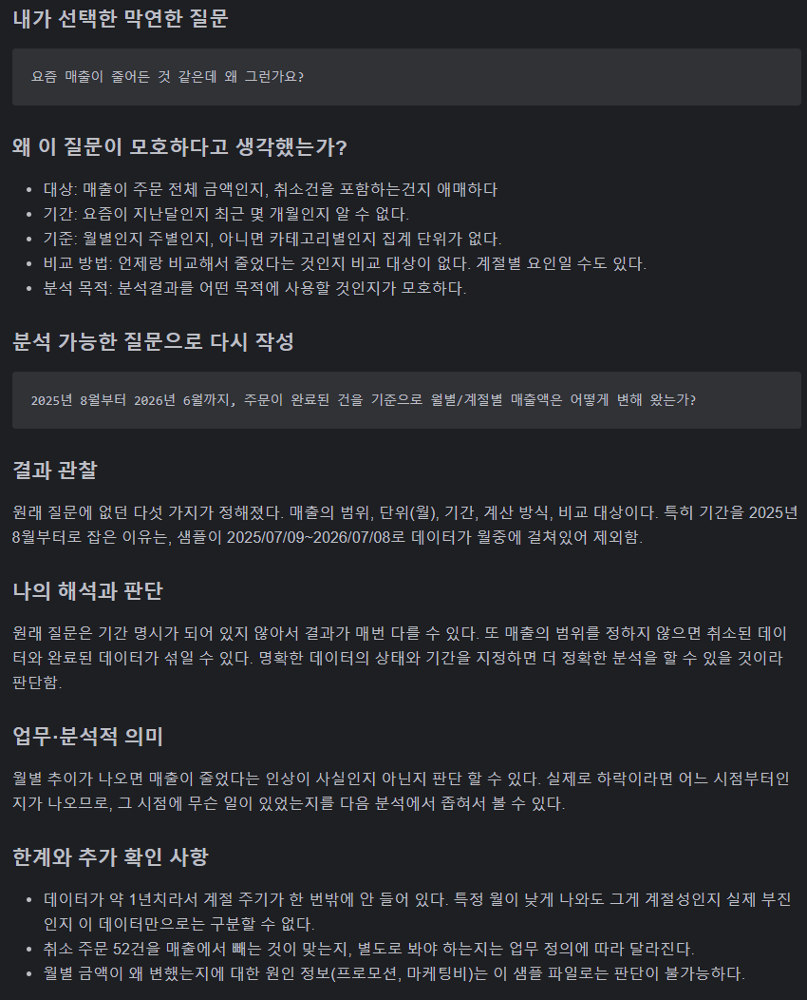
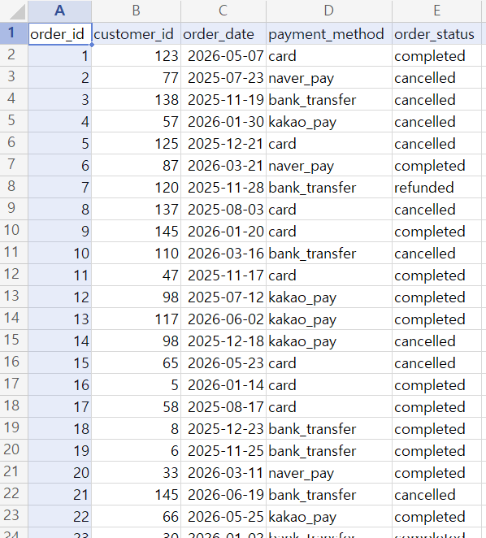
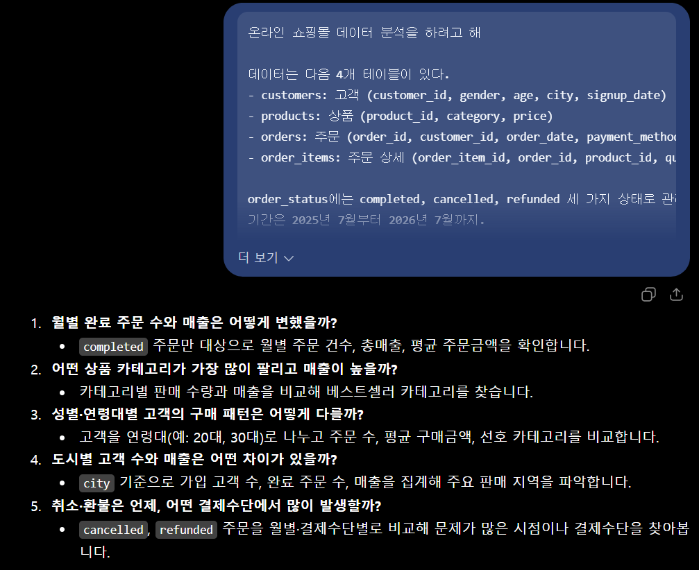
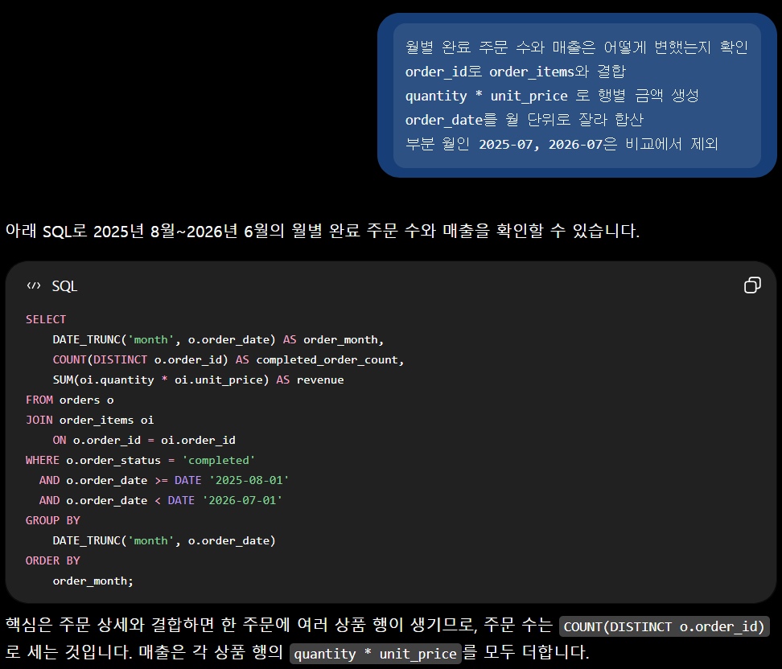
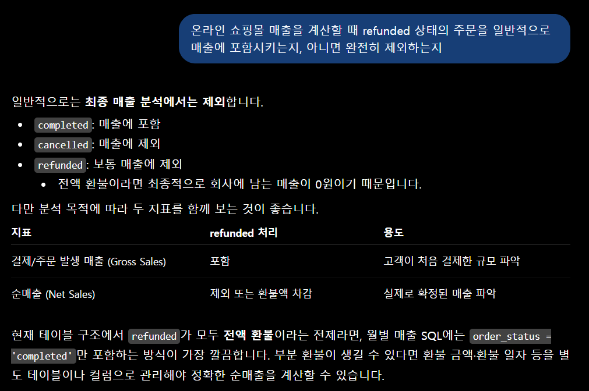
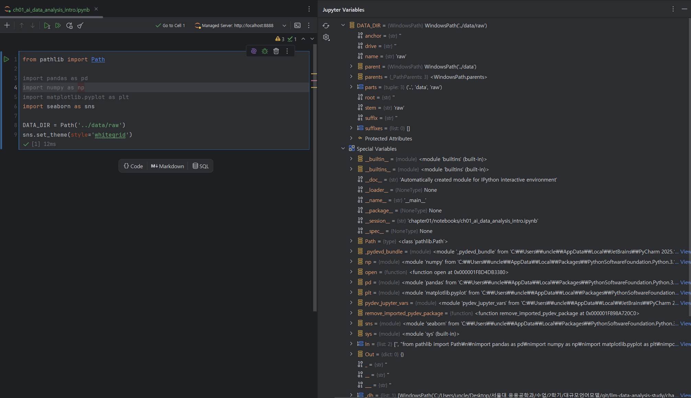

# Chapter 01 제출 답안. AI와 함께하는 데이터 분석의 시작

> 이 파일은 Chapter 01 실습 결과를 정리하여 제출하기 위한 학생용 템플릿입니다.  
> 강사 저장소의 원본 템플릿을 직접 수정하지 말고, 자신의 PC에 복사한 뒤 작성합니다.

---

## 0. 제출 정보

- 이름: 박성주
- GitHub ID: mikeypark
- 개인 저장소명: `llm-data-analysis-study`
- 작성일: 2026/09/06
- 사용한 LLM: ChatGPT 5.6-Terra

### 최종 제출 URL

```text
https://github.com/mikeypark/llm-data-analysis-study/blob/main/chapter01/chapter01.md
```

---

## 1. 원래 업무 질문

### 내가 선택한 막연한 질문

```text
요즘 매출이 줄어든 것 같은데 왜 그런가요?
```

### 왜 이 질문이 모호하다고 생각했는가?

- 대상: 매출이 주문 전체 금액인지, 취소건을 포함하는건지 애매하다
- 기간: 요즘이 지난달인지 최근 몇 개월인지 알 수 없다.
- 기준: 월별인지 주별인지, 아니면 카테고리별인지 집계 단위가 없다.
- 비교 방법: 언제랑 비교해서 줄었다는 것인지 비교 대상이 없다. 계절별 요인일 수도 있다.
- 분석 목적: 분석결과를 어떤 목적에 사용할 것인지가 모호하다.

### 분석 가능한 질문으로 다시 작성

```text
2025년 8월부터 2026년 6월까지, 주문이 완료된 건을 기준으로 월별/계절별 매출액은 어떻게 변해 왔는가?
```

### 결과 관찰

원래 질문에 없던 다섯 가지가 정해졌다. 매출의 범위, 단위(월), 기간, 계산 방식, 비교 대상이다. 
특히 기간을 2025년 8월부터로 잡은 이유는, 샘플이 2025/07/09~2026/07/08로 데이터가 월중에 걸쳐있어 제외함.

### 나의 해석과 판단

원래 질문은 기간 명시가 되어 있지 않아서 결과가 매번 다를 수 있다.
또 매출의 범위를 정하지 않으면 취소된 데이터와 완료된 데이터가 섞일 수 있다.
명확한 데이터의 상태와 기간을 지정하면 더 정확한 분석을 할 수 있을 것이라 판단함. 

### 업무·분석적 의미

월별 추이가 나오면 매출이 줄었다는 인상이 사실인지 아닌지 판단 할 수 있다. 
실제로 하락이라면 어느 시점부터인지가 나오므로, 그 시점에 무슨 일이 있었는지를 다음 분석에서 좁혀서 볼 수 있다.

### 한계와 추가 확인 사항

- 데이터가 약 1년치라서 계절 주기가 한 번밖에 안 들어 있다. 특정 월이 낮게 나와도 그게 계절성인지 실제 부진인지 이 데이터만으로는 구분할 수 없다.
- 반품 주문 52건을 매출에서 빼는 것이 맞는지, 별도로 봐야 하는지는 업무 정의에 따라 달라진다. 
- 월별 금액이 왜 변했는지에 대한 원인 정보(프로모션, 마케팅비)는 이 샘플 파일로는 판단이 불가능하다.

### Evidence



---

## 2. 질문과 필요한 데이터 연결

### 필요한 데이터 파일

- [ ] `customers.csv`
- [ ] `products.csv`
- [x] `orders.csv`
- [x] `order_items.csv`

### 필요한 컬럼 후보

| 파일 | 필요한 컬럼 | 필요한 이유 |
| --- | --- | --- |
| orders.csv | order_id | order_items와 연결하는 키 |
| orders.csv | order_date | 월 단위로 자르기 위한 기준 |
| orders.csv | order_status | completed만 남기기 위한 필터 |
| order_items.csv | order_id | orders와 연결하는 키 |
| order_items.csv | quantity | 금액 계산에 필요 |
| order_items.csv | unit_price | 금액 계산에 필요 |

### 데이터 연결 관계

```text
customers.customer_id  →  orders.customer_id      (1:N)
orders.order_id        →  order_items.order_id    (1:N)
products.product_id    →  order_items.product_id  (1:N)
```

### 결과 관찰

파일을 직접 확인한 결과는 다음과 같다

```text
orders.csv         order_id, customer_id, order_date, payment_method, order_status
order_items.csv    order_item_id, order_id, product_id, quantity, unit_price
```

여기서 확인한 가장 중요한 사실은 orders.csv에 주문 금액 컬럼이 없다는 것이다. 컬럼이 5개고 그중 금액에 해당하는 것은 없다. 따라서 매출은 반드시 order_items의 quantity × unit_price를 주문 단위로 합산해서 만들어야 한다.

또 order_status는 completed/cancelled/refunded 세 종류였다. 실습 가이드 예시에는 completed와 cancelled만 언급되어 있는데 실제 데이터에는 refunded가 하나 더 있다.

### 나의 해석과 판단

현재 데이터만으로 "월별 매출이 어떻게 변했는가"라는 질문에는 답할 수 있다고 판단했다. 필요한 컬럼이 전부 존재하고, 참조 관계도 끊긴 데가 없기 때문이다. 다만 "왜 변했는가"에는 답할 수 없다. 원인에 해당하는 정보가 데이터에 없기 때문에, 이 질문은 현상 확인까지만 가능하고 원인은 추가 데이터가 있어야 한다고 봤다.

### 업무·분석적 의미

질문을 먼저 데이터 구조에 대보면, 코드를 한 줄도 쓰기 전에 "이 질문은 지금 데이터로 답이 되는가"를 판단할 수 있다. 금액 컬럼이 없다는 사실을 미리 알았기 때문에, 집계 로직을 어떻게 짜야 하는지도 미리 정해진다.

### 한계와 추가 확인 사항

- unit_price가 products.price와 764건 전부 일치했다. 이 데이터에는 할인이나 시점별 가격 변동이 전혀 반영되어 있지 않다. 실제 쇼핑몰이라면 두 값이 다를 수 있으므로, 실무 데이터에서는 어느 쪽을 매출 기준으로 쓸지 따로 정해야 한다.
- 배송비, 쿠폰, 부분 환불 같은 항목이 데이터에 없다. 여기서 계산하는 매출은 상품 금액 합계일 뿐이다.


### Evidence



---

## 3. LLM에게 분석 질문 후보 요청

### 사용 목적

데이터 구조는 파악했지만 어떤 질문부터 봐야 할지 우선순위를 정하기 어려웠다. 그래서 정답을 받으려는 목적이 아니라, 내가 미처 생각하지 못한 각도의 질문 후보를 넓게 받아보려고 LLM을 사용했다.

### 사용한 Prompt

```text
온라인 쇼핑몰 데이터 분석을 하려고 해

데이터는 다음 4개 테이블이 있다.
- customers: 고객 (customer_id, gender, age, city, signup_date)
- products: 상품 (product_id, category, price)
- orders: 주문 (order_id, customer_id, order_date, payment_method, order_status)
- order_items: 주문 상세 (order_item_id, order_id, product_id, quantity, unit_price)

order_status에는 completed, cancelled, refunded 세 가지 상태로 관리할거야.
기간은 2025년 7월부터 2026년 7월까지.

초보 데이터 분석자용 질문 5개를 제안해줘.
```

### LLM 답변 요약

1. **월별 완료 주문 수와 매출은 어떻게 변했을까?**
   * `completed` 주문만 대상으로 월별 주문 건수, 총매출, 평균 주문금액을 확인합니다.
2. **어떤 상품 카테고리가 가장 많이 팔리고 매출이 높을까?**
   * 카테고리별 판매 수량과 매출을 비교해 베스트셀러 카테고리를 찾습니다.
3. **성별·연령대별 고객의 구매 패턴은 어떻게 다를까?**
   * 고객을 연령대(예: 20대, 30대)로 나누고 주문 수, 평균 구매금액, 선호 카테고리를 비교합니다.
4. **도시별 고객 수와 매출은 어떤 차이가 있을까?**
   * `city` 기준으로 가입 고객 수, 완료 주문 수, 매출을 집계해 주요 판매 지역을 파악합니다.
5. **취소·환불은 언제, 어떤 결제수단에서 많이 발생할까?**
   * `cancelled`, `refunded` 주문을 월별·결제수단별로 비교해 문제가 많은 시점이나 결제수단을 찾아봅니다.

### 결과 관찰

시간에 따른 추이와 고객 통계별 질문을 적절히 섞여 제안했다.

### 나의 해석과 판단

대체로 바로 적용해볼 수 있는 질문 리스트라고 생각한다. 하지만, 실제 데이터를 모르는 상황에서 통계적으로 유의미한 질문일지는 확신할 수 없을 것 같다.

### 업무·분석적 의미

LLM은 분석의 시작 단계에서 "무엇을 볼 수 있는가"의 후보를 빠르게 넓혀주는 데 도움이 됐다. 혼자 생각하면 처음 떠오른 한두 개 각도에 갇히기 쉬운데, 짧은 시간에 여러 방향을 늘어놓고 그중에서 고를 수 있게 해준다는 점이 실질적인 이득이라고 느꼈다. 다만 어떤 질문을 실제로 볼지 고르는 것은 여전히 사람의 몫이었다.

### 한계와 추가 확인 사항

LLM에게는 컬럼 이름만 알려줬고 실제 데이터 값은 보여주지 않았다. 따라서 LLM은 각 컬럼에 어떤 값이 들어 있는지, 결측이 있는지, 행이 몇 개인지를 모르는 상태에서 제안한 것이다. 제안된 질문이 실제로 계산 가능한지는 다음 단계에서 데이터로 직접 확인해야 한다.

### Evidence



---

## 4. LLM 제안 검증

LLM 제안 중 하나 이상을 선택해 검토합니다.

| 검증 항목 | 확인 내용                                                                                           |
| --- |-------------------------------------------------------------------------------------------------|
| 선택한 LLM 제안 | 월별 완료 주문 수와 매출은 어떻게 변했을까?                                                                       |
| 필요한 파일 | orders.csv                                                                                      |
| 필요한 컬럼 | orders.csv의 컬럼은 order_id, customer_id, order_date, payment_method, order_status 5개뿐이고 금액 컬럼이 없음 |
| 계산 범위 | completed order                                                                                 |
| 실제 데이터 확인 필요 여부 | 필요함. 컬럼 존재 여부와 status 값 종류를 직접 확인해야 했음                                                          |
| 원인 단정 여부 | 없음                                                                                              |
| 최종 판단 | 그대로 사용하여도 무관                                                                                    |

### 내가 수정한 내용

```text
LLM 제안:
  월별 완료 주문 수와 매출은 어떻게 변했을까? 

수정본:
  월별 완료 주문 수와 매출은 어떻게 변했는지 확인
  order_id로 order_items와 결합
  quantity * unit_price 로 행별 금액 생성
  order_date를 월 단위로 잘라 합산
  부분 월인 2025-07, 2026-07은 비교에서 제외
```

### 결과 관찰

orders.csv를 직접 열어 헤더를 확인한 결과 금액 컬럼이 존재하지 않았다. 
LLM이 제안한 방식대로 코드를 짰다면 KeyError가 나거나, 혹은 임의로 만들어낸 컬럼명을 쓰다가 잘못된 결과가 나왔을 것이다.

### 나의 해석과 판단

수정 후 사용으로 판단했다. 제안의 방향(월별로 합산해서 추이를 본다) 자체는 내 질문에 맞았기 때문에 버릴 이유는 없었다. 다만 그 방향을 실행하는 구체적인 경로가 실제 데이터 구조와 어긋나 있었으므로, 금액을 만드는 단계와 상태 필터를 내가 직접 채워 넣어야 했다. 방향은 LLM에게서 얻고 정확성은 내가 책임지는 형태가 됐다.

### 업무·분석적 의미

이 제안은 문장만 보면 전혀 이상하지 않다. 오히려 자연스럽고 그럴듯하다. 검증하지 않고 그대로 코드로 옮겼다면 오류로 바로 막히거나, 더 나쁜 경우에는 엉뚱한 컬럼으로 계산된 숫자가 나와서 그 숫자를 근거로 보고를 했을 것이다. 실행이 된다는 사실과 결과가 맞다는 사실은 완전히 다른 문제라는 것을 이 단계에서 실제로 확인했다.

### 한계와 추가 확인 사항

- LLM이 제안한 나머지 질문 후보들은 아직 같은 방식으로 검증하지 못했다.
- refunded를 매출에서 제외하는 것이 업무적으로 맞는 정의인지는 데이터만으로는 결정할 수 없다.
- 부분 월 제외 기준(2025-07, 2026-07)은 내가 정한 것이고, 다른 기준을 쓰면 결과가 달라질 수 있다.

### Evidence



---

## 5. Prompt Log

- 사용 목적: 월별 매출 추이라는 방향은 정했지만, 그 외에 먼저 확인해볼 만한 분석 질문 후보를 넓게 받아보기 위해
- 입력 Prompt 요약: 매출 계산시 refunded 건을 포함하는지 제외하는지
- LLM 답변 요약: 제외하는것이 맞다.
- 실제 반영 여부: 월별 매출 합산 방향 수정 후 채택
- 사람이 검증한 항목: orders.csv의 실제 컬럼 목록, order_status의 고유값과 건수, order_items의 금액 계산 가능 여부, order_date의 범위
- 사람이 수정한 내용: 금액을 order_items의 quantity × unit_price로 생성하도록 경로 변경, `completed` 상태 필터 추가
- 남은 확인 사항: cancle 건에 대한 부분은 어떻게 할지

### 결과 관찰

로그를 남기고 보니, LLM의 답변에서 내 최종 분석으로 넘어오는 과정에 수정이 세 군데 있었다. 금액 생성 경로, 상태 필터, 기간 범위다. 
기록하지 않았다면 나중에 이 세 가지가 내 판단이었는지 LLM의 제안이었는지 구분하기 어려웠을 것이다.

### 나의 해석과 판단

Prompt Log가 필요한 이유는 결과를 나중에 누가 다시 볼 때 이 숫자가 어디서 왔는지추적할 수 있게 하기 위해서라고 생각한다. 
특히 AI를 쓰면 중간 과정이 대화 안에 흩어져 사라지기 쉽다. 
어느 부분이 AI 제안이고 어느 부분이 내가 고친 것인지 남겨두지 않으면, 나중에 오류가 발견됐을 때 어디를 다시 봐야 하는지조차 알 수 없게 된다. 
그리고 이 기록이 있으면 최소한 검증을 했다는 사실 자체가 증거로 남는다.

### Evidence



---

## 6. 개인정보와 Secret 보호 확인

다음 항목을 확인합니다.

- [x] 실제 이름·이메일·전화번호 등 고객 개인정보를 Prompt에 사용하지 않았습니다.
- [x] API Key를 코드나 Notebook에 직접 작성하지 않았습니다.
- [x] `.env` 실제 내용을 캡처하거나 업로드하지 않았습니다.
- [x] GitHub Token, 비밀번호, 내부 URL이 캡처에 보이지 않습니다.
- [x] 제출 전 이미지까지 다시 확인했습니다.

### 나의 판단

이번 실습에서 가장 조심해야 한다고 판단한 것은 customers 의 name 컬럼이다. 
합성 데이터이긴 하지만 실제 한글 이름 형태로 들어 있어서, 데이터 구조를 캡처하거나 LLM에게 보여줄 때 이 컬럼이 화면에 그대로 노출될 수 있다. 
그래서 LLM에는 데이터 값 대신 컬럼명만 전달했고, 캡처가 필요한 경우 이름 컬럼은 가리기로 했다.

또 하나는 API Key다. 
저장소에 .env.example이 있는데, 여기에 실제 키를 채워 넣고 .env로 저장하는 순간 실수로 커밋될 위험이 생긴다. 
.gitignore에 .env가 들어 있는지 먼저 확인하는 것이 안전하다고 판단했다. 
개인 저장소를 Public으로 두면 한 번 올라간 키는 삭제해도 커밋 히스토리에 남기 때문에, 올리고 나서 지우는 것으로는 해결되지 않는다.

---

## 7. Chapter 01 Notebook 확인

Notebook:

```text
notebooks/ch01_ai_data_analysis_intro.ipynb
```

### 내 환경 상태

- [ ] 아직 환경설정 전이라 Notebook 위치만 확인했습니다.
- [x] 환경설정이 완료되어 Notebook을 직접 실행했습니다.

`.venv`에 Python 3.11.9 기준으로 pandas 3.0.5, numpy 2.4.6, matplotlib 3.11.1, seaborn 0.13.2, jupyter, ipykernel이 설치되어 있는 것을 확인했다.

### 환경설정 완료 학생만 작성

#### 실행한 코드

```python
from pathlib import Path

import pandas as pd
import numpy as np
import matplotlib.pyplot as plt
import seaborn as sns

DATA_DIR = Path('../data/raw')
sns.set_theme(style='whitegrid')
```

#### 실행 결과

오류없이 실행.

#### 결과 관찰

 import가 전부 통과됐고 별도 출력은 없었다.

#### 나의 해석과 판단

현재 Notebook은 라이브러리 import와 데이터 경로(`DATA_DIR`)만 잡아둔 껍데기다. 
그래서 이 노트북의 역할은 여기서 분석을 하라가 아니라 앞으로 분석할 때 필요한 환경이 제대로 잡혔는지 먼저 확인하라에 가깝다고 이해했다.

#### 한계와 추가 확인 사항

- import가 통과한다고 해서 실제로 CSV가 정상적으로 읽히는지까지 확인된 것은 아니다. 인코딩 문제가 있을 수 있다.

#### Evidence



---

## 8. Chapter 01 최종 해석

### 이번 장에서 가장 중요하다고 생각한 내용

```text
분석은 코드가 아니라 질문에서 시작한다는 것이다. 
매출이 줄었나요라는 질문을 들고 데이터로 갔다면 무엇을 세야 할지조차 정하지 못했을 것이다. 
대상,기준,비교,목적을 정하고 어떤 파일의 어떤 컬럼이 필요한지가 나왔다. 
그리고 그 과정에서 orders에 금액 컬럼이 없다는 사실을 코드를 쓰기 전에 발견할 수 있었다. 
결국 이번 장에서 배운 순서는 질문을 정하고, 그 질문을 데이터 구조에 대보고, 그 다음에야 도구를 잡는다는 것이었다.
```

### LLM을 데이터 분석에 사용할 때 가장 조심해야 할 점

```text
결과가 그럴듯해 보여서 검증을 건너뛰게 되는 것이라고 생각한다. 
이번에 받은 orders의 주문 금액을 월별로 합산하라는 제안은 문장만 보면 어디도 이상하지 않았다. 
오히려 내가 하려던 것과 정확히 맞아떨어져서 그냥 받아들이기 쉬웠다. 
실제 파일을 열어보고 나서야 그 컬럼이 존재하지 않는다는 걸 알았다. 
만약 컬럼명이 우연히 존재하는 다른 이름이었다면 코드는 오류 없이 돌아갔을 것이고, 나는 잘못된 숫자를 맞는 숫자로 알고 썼을 것이다. 
AI가 틀릴 수 있다는 건 누구나 알지만, 문제는 틀린 답이 틀려 보이지 않는다는 데 있다고 느꼈다. 
그래서 답이 그럴듯할수록 오히려 데이터로 한 번 더 확인해야 한다는 것이 이번 실습의 교훈이었다.
```

### 사람과 LLM의 역할 차이

| 항목 | LLM이 도울 수 있는 부분 | 사람이 책임져야 하는 부분                           |
| --- | --- |------------------------------------------|
| 질문 정의 | 생각하지 못한 각도의 질문 후보를 빠르게 여러 개 제시 | 그중 지금 업무에 필요한 질문을 정의하고 확정                |
| 데이터 확인 | 일반적인 스키마 구조와 확인 항목을 설명 | 실제 파일을 열어 컬럼 존재 여부, 값의 종류 등을 직접 확인       |
| 코드 작성 | 문법과 함수 사용법, 코드 초안 작성 | 그 코드가 우리 데이터 구조에 맞는지, 계산 범위가 맞는지 검토      |
| 결과 해석 | 일반적인 해석 방향과 표현 제안 | 이 숫자가 실제로 무엇을 뜻하는지, 어디까지 해석 할 수 있는지 판단   |
| 최종 판단 | 없음 | 전부. 이 결과를 근거로 무엇을 결정할지, 무엇을 아직 말하면 안 되는지 |

### 다음 Chapter에서 확인하고 싶은 것

- orders와 order_items를 merge할 때 행 수가 어떻게 변하는지 직접 보고 싶다. 1:N 관계라 주문 300건이 아이템 764행으로 늘어날 텐데, 집계 전에 중복이 생기지 않는지 확인이 필요하다.

---

## 9. 최종 제출 체크리스트

- [x] 원래 업무 질문과 구체화한 분석 질문을 작성했습니다.
- [x] 질문에 필요한 데이터 파일과 컬럼 후보를 정리했습니다.
- [x] LLM Prompt와 답변 요약을 작성했습니다.
- [x] LLM 제안을 실제 데이터 관점에서 검증했습니다.
- [x] 각 핵심 STEP의 결과 관찰을 작성했습니다.
- [x] 각 핵심 STEP의 나의 해석과 판단을 작성했습니다.
- [x] 업무·분석적 의미를 작성했습니다.
- [x] 한계와 추가 확인 사항을 작성했습니다.
- [x] 핵심 실행 Evidence 이미지를 첨부했습니다.
- [x] 이미지가 Markdown에서 정상 표시됩니다.
- [x] 개인정보가 없습니다.
- [x] API Key·Secret·Token이 없습니다.
- [x] 개인 GitHub 저장소에 업로드했습니다.
- [x] GitHub에서 Markdown과 이미지가 정상 표시됩니다.
- [x] 아래 최종 파일 URL이 정상적으로 열립니다.

### 최종 파일 URL

```text
https://github.com/mikeypark/llm-data-analysis-study/blob/main/chapter01/chapter01.md
```

---

## 10. 교수자 확인용 요약

### 수행 상태

- [x] COMPLETE
- [ ] PARTIAL

### 내가 가장 중요하게 내린 판단 1개

```text
LLM이 제안한 orders의 주문 금액을 월별로 합산하라를 그대로 쓰지 않고, 실제 파일을 열어 금액 컬럼이 없다는 것을 확인한 뒤 order_items의 quantity × unit_price로 매출을 직접 만들어 쓰기로 결정한 것. 
제안의 방향은 맞았지만 실행 경로가 데이터와 어긋나 있어서 수정 후 사용하는 것으로 판단했다.
```
### 아직 확인이 필요한 내용 1개

```text
refunded 주문 52건을 매출에서 제외하는 것이 업무적으로 올바른 정의인지 결정할 수 없다
```