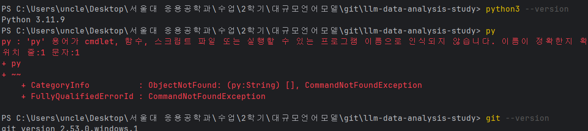
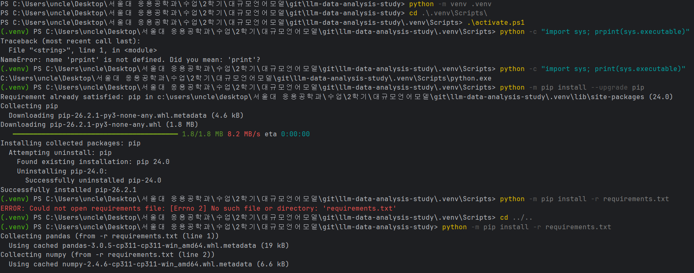
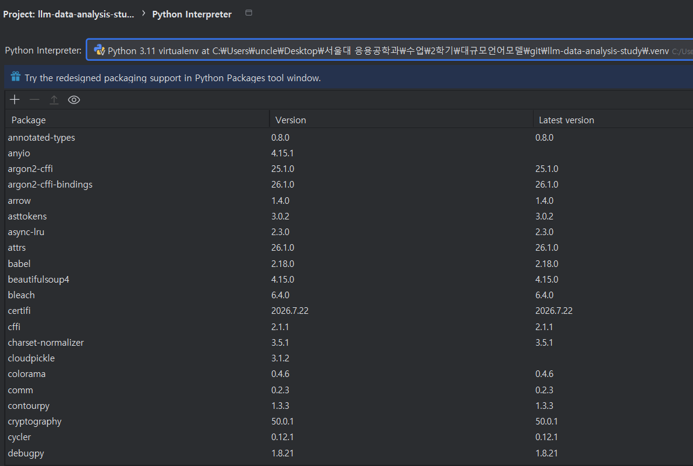
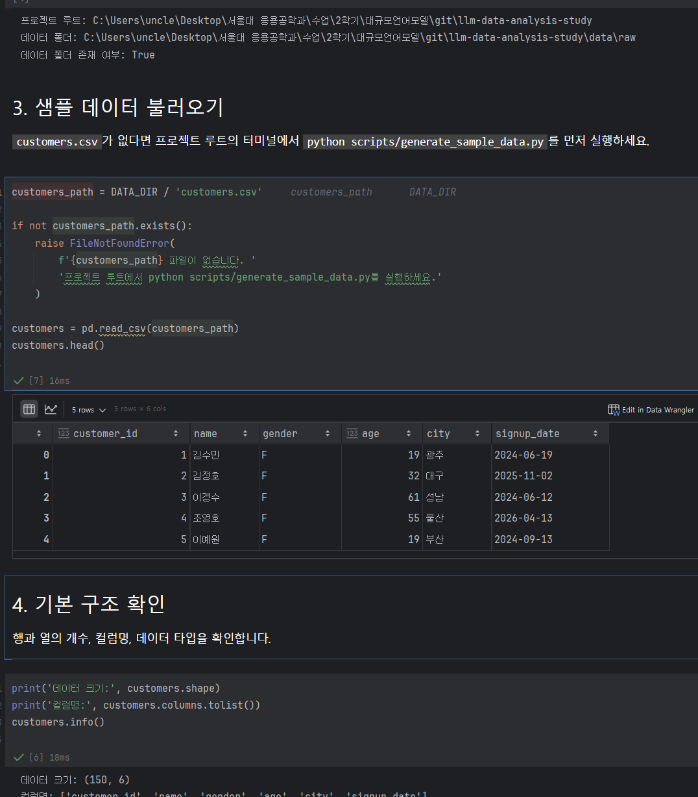
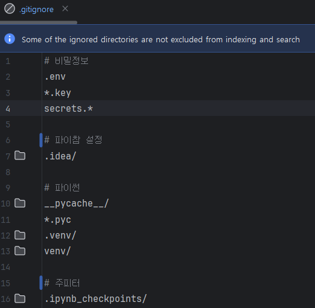

# Chapter 02 제출 답안. VS Code에서 시작하는 데이터 분석 환경

> 최종 파일은 개인 GitHub 저장소의 `chapter02/chapter02.md`로 저장하는 것을 권장합니다.

## 0. 제출 정보

- 이름: 박성주
- GitHub ID: mikeypark
- 개인 저장소: llm-data-analysis-study
- 작성일: 2026/09/11
- 운영체제: Windows 11

### 최종 제출 URL

```text
https://github.com/mikeypark/llm-data-analysis-study/blob/main/chapter02/chapter02.md
```

---

## 1. Python과 Git 환경 확인

### 실행 내용

```text
python --version
git --version
```

### 실행 결과

```text
Python 3.11.9
git version 2.53.0.windows.1
```

### Evidence



### 결과 관찰

Python 3.11.9, Git 2.53.0 둘 다 정상 인식 python 명령이 PATH에 잡혀 있다. py 명령어는 없는 것 같은데 따로 더 설정하지는 않았다.

### 나의 해석과 판단

pandas, numpy, jupyter 모두 3.11과 잘 맞는 버전이라 실습 환경으로 문제없다고 판단했다.

### 업무·분석적 의미

버전을 먼저 확인해두면 나중에 같은 환경을 재현할 때 기준이 생긴다. 패키지마다 지원하는 Python 버전이 달라서 버전 불일치로 설치가 깨지는 경우가 있기 때문이다.

### 한계와 추가 확인 사항

PATH에 Python이 여러 개 잡혀 있을 수 있다(시스템 python, conda 등)

---

## 2. 저장소와 `.venv` 준비

### 수행 내용

- [x] 공식 Public 저장소 clone
- [x] 프로젝트 루트 확인
- [x] `.venv` 생성
- [x] `.venv` 활성화
- [x] `requirements.txt` 설치

### 핵심 실행 결과

```text
현재 프로젝트 경로: C:\Users\uncle\Desktop\서울대 응용공학과\수업\2학기\대규모언어모델\git\llm-data-analysis-study
터미널 Python 실행 파일: C:\...\llm-data-analysis-study\.venv\Scripts\python.exe
가상환경 활성화 여부: (.venv) 표시 확인
패키지 설치 결과: requirements.txt 기반 설치 완료, 오류 없음
```

### Evidence



### 결과 관찰

sys.executable 출력 결과에 .venv\Scripts\python.exe가 포함되어 있어 가상환경이 잡힌 걸 확인했다.

### 나의 해석과 판단

프로젝트마다 필요한 패키지 버전이 다를 수 있어서 .venv로 분리하는 게 맞다. 가상환경 없이 시스템 하나로 여러 프로젝트를 관리하면 버전 충돌이 생긴다.

### 업무·분석적 의미

requirements.txt 만 있으면 pip install -r requirements.txt  한 줄로 같은 여러 사람이 동일한 환경을 만들 수 있다.

### 한계와 추가 확인 사항

requirements.txt 로 버전을 고정해도 OS나 Python 버전이 다르면 C 확장 포함 패키지가 설치 안 될 수 있다고 함.

---

## 3. VS Code 인터프리터와 Jupyter 커널 연결

### 확인 결과

```text
PyCharm Python 인터프리터: C:\...\llm-data-analysis-study\.venv\Scripts\python.exe
Notebook sys.executable: C:\...\llm-data-analysis-study\.venv\Scripts\python.exe
Notebook Path.cwd(): C:\Users\uncle\Desktop\서울대 응용공학과\수업\2학기\대규모언어모델\git\llm-data-analysis-study
```

### Evidence



### 결과 관찰

터미널 Python과 Notebook Python 모두 같은 .venv를 가리키고 있다. Python: Select Interpreter에서 .venv를 선택하고 notebook 도 맞춰줬다.

### 나의 해석과 판단

커널과 인터프리터가 다른 Python을 가리키면 터미널에서 설치한 패키지를 Notebook에서 import 할 수 없다. ModuleNotFoundError 가 뜬다

### 업무·분석적 의미

환경이 일치하면 팀원이 같은 notebook을 돌려도 동일한 결과가 나온다. 

### 한계와 추가 확인 사항
VS Code 가 아닌 조금 더 익숙한 PyCharm 으로 진행.
커널 선택 목록의 이름만 보면 안 되고, notebook 안에서 sys.executable 을 직접 출력해서 경로를 확인해야 한다.

---

## 4. 샘플 데이터와 Notebook 실행 검증

### 확인 결과

```text
DATA_DIR 존재 여부: True
customers.csv 존재 여부: True
customers.shape: (150, 6)
주요 컬럼: customer_id, name, gender, age, city, signup_date
```

### Evidence



### 결과 관찰

customers.csv 는 150행 컬럼은 customer_id, name, gender, age, city, signup_date다. pd.read_csv() 가 에러 없이 실행됐고 customers.head()도 정상 출력됐다.

### 나의 해석과 판단

notebook 커널이 .venv를 쓰고 있고, pandas가 설치됐고, data/raw/customers.csv가 정상로딩 확인된다. 

### 업무·분석적 의미

분석을 본격적으로 시작하기 전에 데이터를 한 번 읽어보는 테스트를 하면 환경 문제를 일찍 발견할 수 있다.

### 한계와 추가 확인 사항

여기서는 환경 연결만 확인한 거고 데이터 품질은 아직 안 봤다. 

---

## 5. 오류 해결 기록

해당 없음

---

## 6. Secret 보호 확인

- [x] `.env`는 Git 추적 대상이 아닙니다.
- [x] 실제 API Key를 코드에 작성하지 않았습니다.
- [x] 캡처 화면에 Token/비밀번호가 없습니다.
- [x] `.venv`를 Git에 올리지 않습니다.

### Evidence

`.gitignore` 확인 결과:

```text
# 비밀정보
.env
*.key
secrets.*

# 파이썬
__pycache__/
*.pyc
.venv/
venv/

# 주피터 노트북 
.ipynb_checkpoints/
```



### 나의 해석과 판단

API KEY를 코드에 직접 쓰면 github에 올렸을 때 누구나 볼 수 있다. 
한 번 커밋되면 파일을 지워도 히스토리에 남아 있어서 처음부터 .env에 분리하고 .gitignore에 넣는 게 맞다. 
.venv도 용량도 크고 OS마다 구조가 달라서 git에 올리면 안 된다.

---

## 7. Chapter 02 최종 회고

### 가장 중요했다고 생각한 환경 설정 1가지

```text
Notebook 커널을 프로젝트 가상환경과 일치시키는 것
```

### 그 이유

```text
터미널에서 패키지를 설치해도 커널이 다른 파이썬 인터프리터를 가리키면 소용없다.
ModuleNotFoundError가 뜰 때 원인이 커널 불일치인 경우가 많은데, 에러 메시지만 봐선 바로 안 보인다.
sys.executable을 꼭 확인하자.
```

### 다음 Chapter에서 재사용할 환경 체크 3가지

1. sys.executable이 .venv를 가리키는지 확인
2. Path.cwd()가 프로젝트 루트인지 확인
3. DATA_DIR.exists()가 True인지 확인

### 현재 환경의 한계 또는 주의점

```text
프로젝트 경로에 한글이 포함되어 있어 일부 도구에서 경로 처리가 잘못될 수 있을 것 같지만, 문제 생기면 바꾸겠다.
```

---

## 최종 제출 체크

- [x] 핵심 Evidence 4~7장을 첨부했습니다.
- [x] 단순 캡처가 아니라 관찰과 판단을 작성했습니다.
- [x] Secret/개인정보가 없습니다.
- [x] GitHub에서 이미지가 정상 표시됩니다.
- [x] 개인 저장소에 `chapter02/chapter02.md`를 업로드했습니다.
- [x] 저장소 URL이 아니라 최종 파일 URL을 제출합니다.
